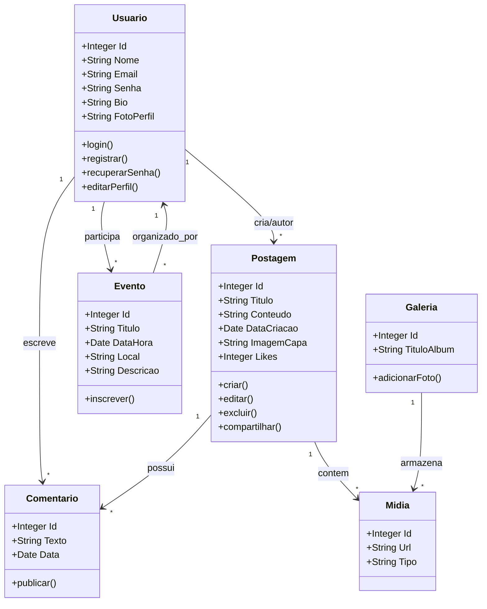

# Gardiãs das Águas 🌊
 Guardiãs das Águas é um projeto socioambiental voltado para a **preservação** dos recursos hídricos e para a **construção** de uma cultura de cuidado com rios, lagos, nascentes e oceanos. Ele nasce da compreensão de que a água é um recurso essencial para todas as formas de vida e que sua conservação depende tanto de ações práticas quanto de educação e engajamento comunitário.

## Participantes 🧜🧜🧜
- Kelvim Lucas de Paula
- Felipe Cutiur dos Santos
- Ryan Augusto de Oliveira

## Objetivo do projeto 🎯
O objetivo do site Guardiãs das Águas é criar uma plataforma digital completa e acessível que fortaleça a visibilidade do projeto, amplie sua capacidade de impacto e promova a conscientização socioambiental. Através do site, buscamos centralizar informações, comunicar ações e engajar a comunidade em torno da preservação dos recursos hídricos.

## Diagrama de caso de uso

## Tecnologias usadas 💻

### FrontEnd
  

#### Protótipo
O protótipo do conceito do projeto foi feito pelo Felipe Cutiur usando a ferramenta figma:

### BackEnd
  

#### Diagrama de classes
Diagrama de Classes que será usado para criar as tabelas do banco de dados PostgreSQL.
    
---

---
## Wiki
[Wiki do projeto](https://github.com/ProjetoIntegrador-2Semestre/GardiasDasAguas/wiki).

## Agradecimentos

**a todes e todxs.**