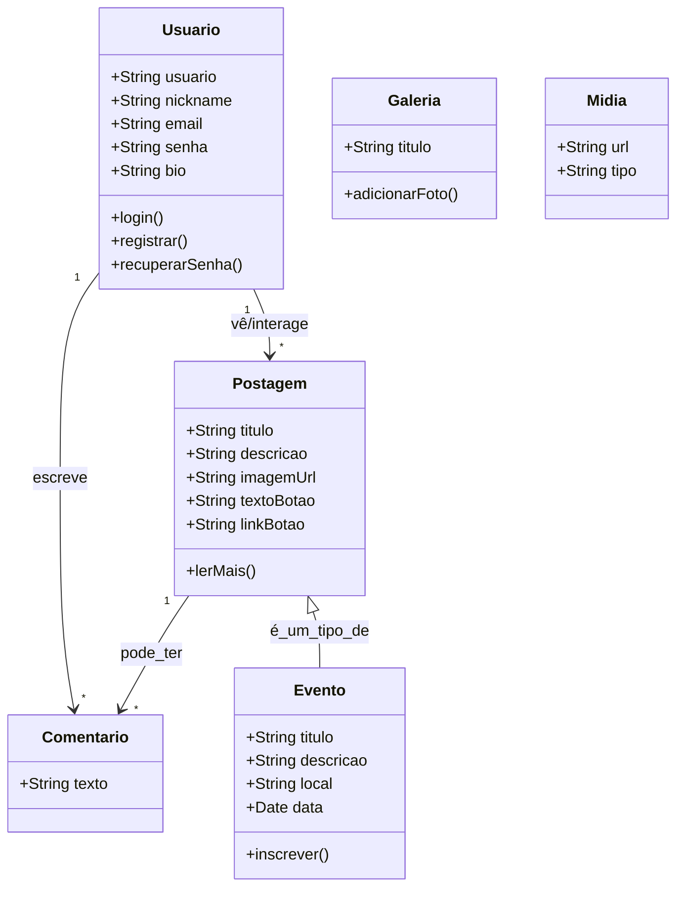

# Diagrama de Classes (Frontend Aligned)

```mermaid
classDiagram
    class Usuario {
        +String usuario
        +String nickname
        +String email
        +String senha
        +String bio
        +login()
        +registrar()
        +recuperarSenha()
    }

    class Postagem {
        +String titulo
        +String descricao
        +String imagemUrl
        +String textoBotao
        +String linkBotao
        +lerMais()
    }

    class Comentario {
        +String texto
    }

    class Evento {
        +String titulo
        +String descricao
        +String local
        +Date data
        +inscrever()
    }

    class Galeria {
        +String titulo
        +adicionarFoto()
    }

    class Midia {
        +String url
        +String tipo
    }

    %% Relacionamentos
    Usuario "1" --> "*" Postagem : vê/interage
    Usuario "1" --> "*" Comentario : escreve
    
    Postagem "1" --> "*" Comentario : pode_ter
    
    %% NossasAcoes no frontend parece misturar Postagem/Evento
    Postagem <|-- Evento : é_um_tipo_de 
```
