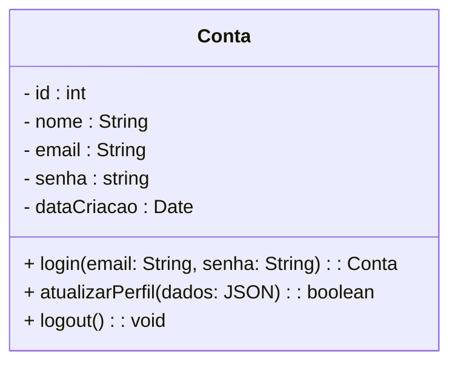
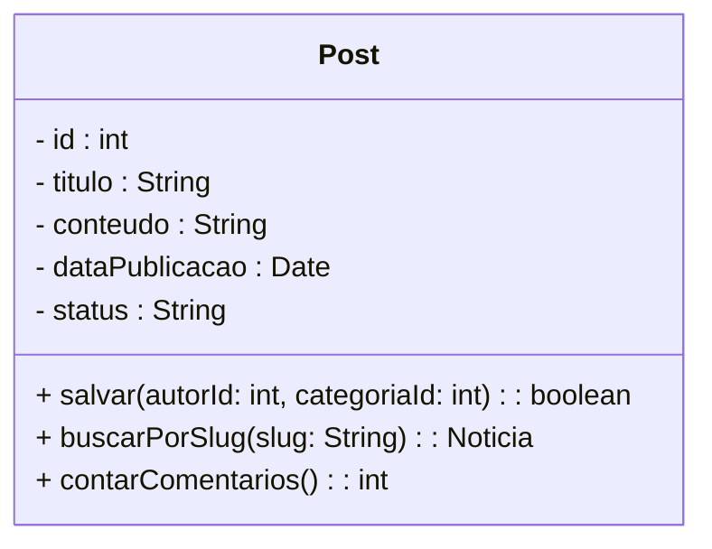
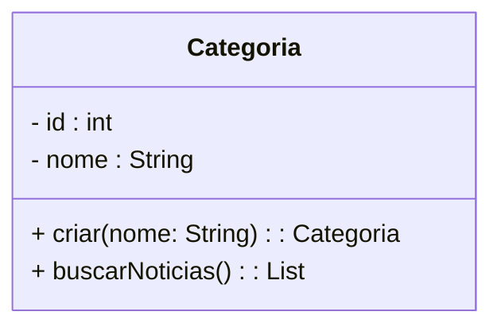
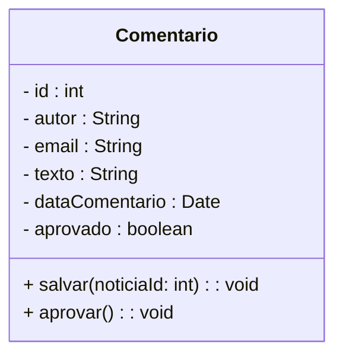

# Diagrama de classes

```mermaid
    classDiagram
    class Conta {
        - id : int
        - nome : String
        - email : String
        - senha : string
        - dataCriacao : Date
        + login(email: String, senha: String) : Conta
        + atualizarPerfil(dados: JSON) : boolean
        + logout() : void
    }
```

```mermaid
    classDiagram
    class Post {
        - id : int
        - titulo : String
        - conteudo : String
        - dataPublicacao : Date
        - status : String
        + salvar(autorId: int, categoriaId: int) : boolean
        + buscarPorSlug(slug: String) : Noticia
        + contarComentarios() : int
    }
```

```mermaid
    classDiagram
    class Categoria {
        - id : int
        - nome : String
        + criar(nome: String) : Categoria
        + buscarNoticias() : List<Noticia>
    }
```

```mermaid
    classDiagram
    class Comentario {
        - id : int
        - autor : String
        - email : String
        - texto : String
        - dataComentario : Date
        - aprovado : boolean
        + salvar(noticiaId: int) : void
        + aprovar() : void
    }
```