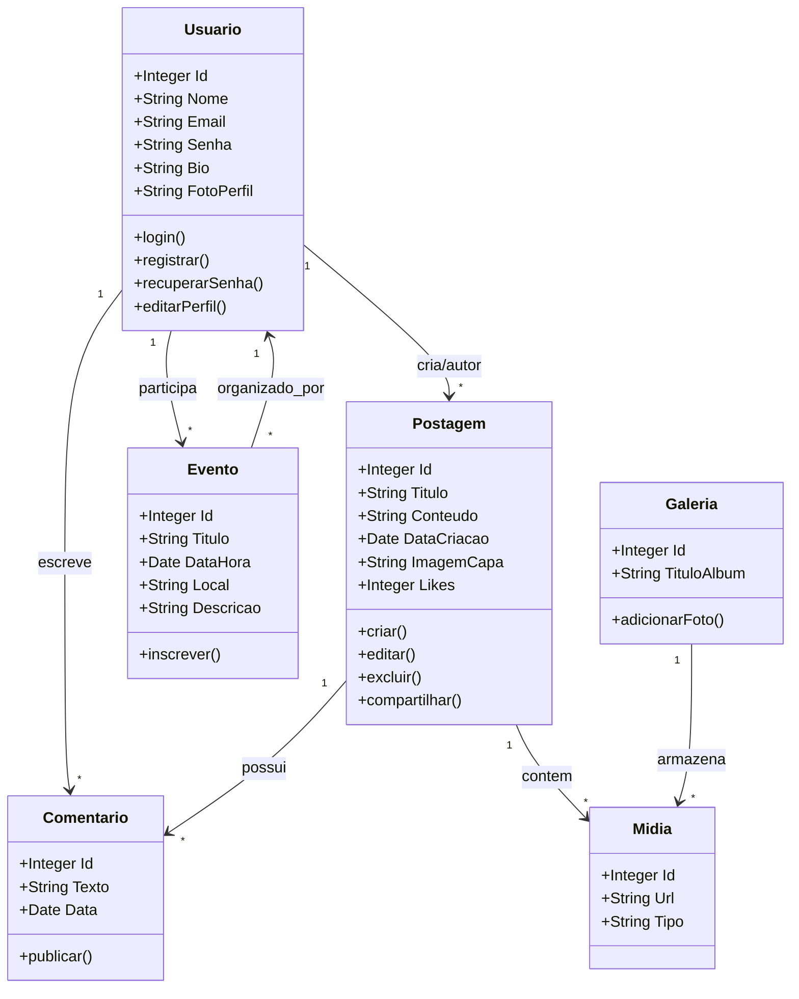

# Diagrama de classes

```mermaid
classDiagram
    class Usuario {
        +Integer Id
        +String Nome
        +String Email
        +String Senha
        +String Bio
        +String FotoPerfil
        +login()
        +registrar()
        +recuperarSenha()
        +editarPerfil()
    }

    class Postagem {
        +Integer Id
        +String Titulo
        +String Conteudo
        +Date DataCriacao
        +String ImagemCapa
        +Integer Likes
        +criar()
        +editar()
        +excluir()
        +compartilhar()
    }

    class Comentario {
        +Integer Id
        +String Texto
        +Date Data
        +publicar()
    }

    class Evento {
        +Integer Id
        +String Titulo
        +Date DataHora
        +String Local
        +String Descricao
        +inscrever()
    }

    class Galeria {
        +Integer Id
        +String TituloAlbum
        +adicionarFoto()
    }

    class Midia {
        +Integer Id
        +String Url
        +String Tipo
    }

    %% Relacionamentos
    Usuario "1" --> "*" Postagem : cria/autor
    Usuario "1" --> "*" Comentario : escreve
    Usuario "1" --> "*" Evento : participa
    
    Postagem "1" --> "*" Comentario : possui
    Postagem "1" --> "*" Midia : contem
    
    Galeria "1" --> "*" Midia : armazena
    
    Evento "*" --> "1" Usuario : organizado_por
```
