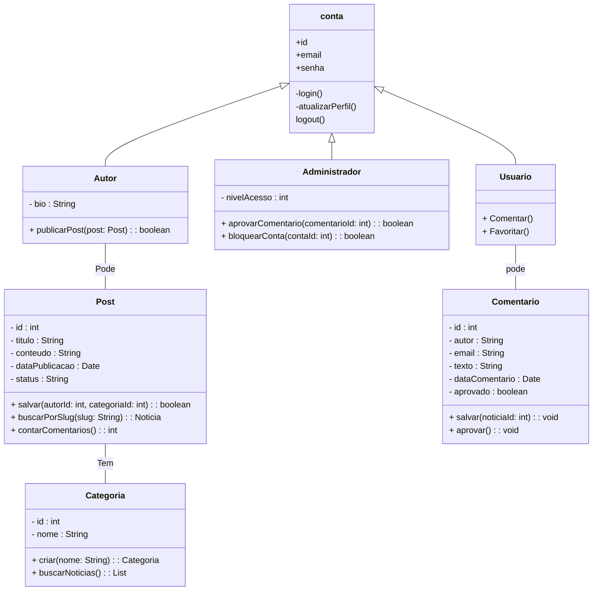

# Diagrama de classes

```mermaid
classDiagram
 conta <|-- Autor
 conta <|-- Administrador
 Autor -- Post : Pode
 Post -- Categoria : Tem
 conta <|-- Usuario
 Usuario -- Comentario : pode 
conta : +id
 conta : +email
 conta : +senha
 conta : -login()
 conta : -atualizarPerfil()
 conta : logout() 
class Comentario {
 - id : int
 - autor : String
 - email : String
 - texto : String
 - dataComentario : Date
 - aprovado : boolean
 + salvar(noticiaId: int) : void
 + aprovar() : void
 } 
class Categoria {
 - id : int
 - nome : String
 + criar(nome: String) : Categoria
 + buscarNoticias() : List<Noticia>
 } 
class Post {
 - id : int
 - titulo : String
 - conteudo : String
 - dataPublicacao : Date
 - status : String
 + salvar(autorId: int, categoriaId: int) : boolean
 + buscarPorSlug(slug: String) : Noticia
 + contarComentarios() : int
 } 
class Administrador {
 - nivelAcesso : int
 + aprovarComentario(comentarioId: int) : boolean
 + bloquearConta(contaId: int) : boolean
 } 
class Autor {
 - bio : String
 + publicarPost(post: Post) : boolean
 } 
class Usuario { 
+ Comentar()
 + Favoritar()
 }
```
